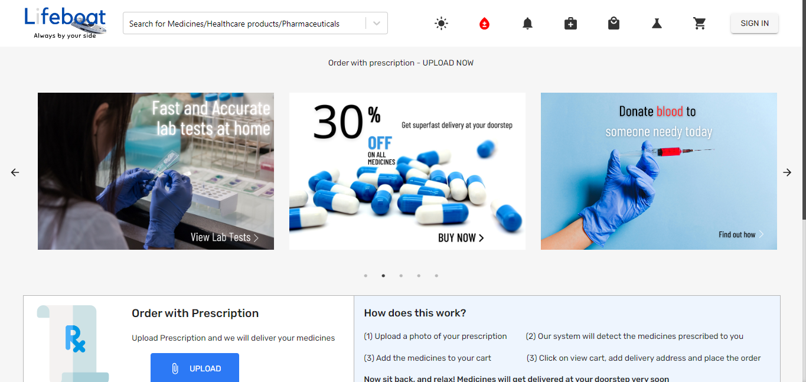
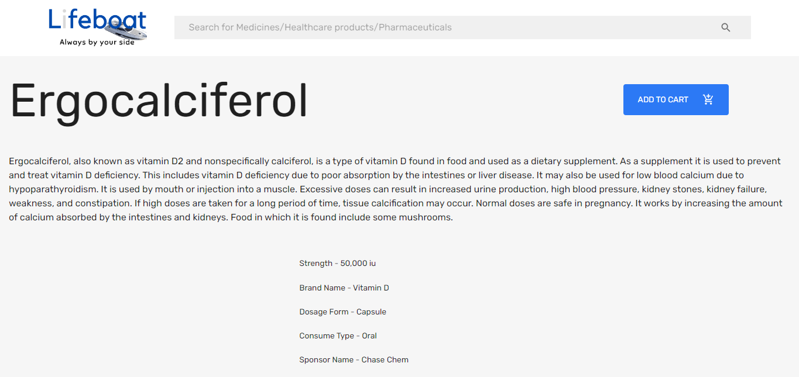
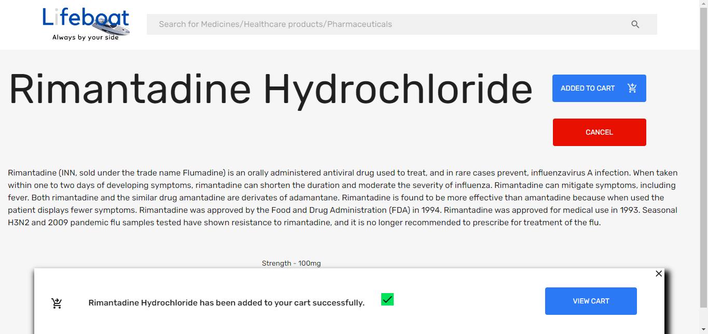

# Life-Boat
A medicine-based full-stack web application developed using MERN, it adheres to the user's request by providing valuable medical information about a particular medicine/drug/pharmaceutical product by fetching data from OpenFDA API and MediaWiki API. The user can also order a product by adding it to their cart or cancel an order anytime as well. There is scope for User Registration/Sign in which implements authentication using JsonWebToken as well as authorization for data security. Development of this app is still under progress. Here are some screenshots and screencasts of the pages.

## Homepage

## Screencast for uploading prescription to dispense prescribed medicines
https://github.com/user-attachments/assets/e8251d54-6c00-4a4d-908b-fa3f0b102b06

## Page for adding an item to cart

## Page for adding a different item (State changed as item has already been added to cart)

